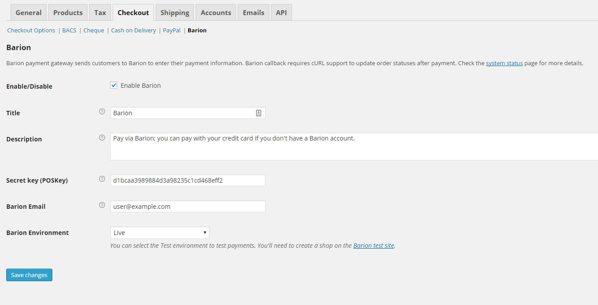

# Barion Payment Gateway for WooCommerce

This plugin allows your customers to pay via [Barion Smart Gateway](https://www.barion.com/) in your WooCommerce online store.

## Features

- Adds Barion as a payment option to the WooCommerce checkout page
- Redirects the user to the Barion payment page after checkout
- Handles the callback from Barion after payment
  - sets the order status to "processing", "completed" or "failed" respectively
- Refund payments via Barion

## Installation

1. The recommended way to install the plugin is through the "Plugins" menu in WordPress
  - Navigate to Plugins > Add New > Search for "barion", you should already see this plugin
  - Hit "Install Now", then enable the plugin
1. Click on the menu item "WooCommerce", then select the "Checkout" tab
1. Click on the new submenu item named "Barion"
1. On this page you should set the POSKey of the shop and your Barion email address 
1. Should you want to use the test envorinment, select it from the Barion Environment dropdown. You'll need to create a shop on the [Barion test page](https://test.barion.com).
1. Enable the payment method if you're ready to use Barion

## Feedback

I'd be happy to hear your feedback! Feel free to contact me at szelpeter@szelpeter.hu 

## Contribution

You're welcome to contribute to this open source plugin by creating pull-requests on [Github](https://github.com/szelpe/woocommerce-barion). To do this, you need to fork the repository, implement the changes and push them to your fork. After that you can create a pull request to merge changes from your fork the main repository.

## Bugs

[Please report bugs as Github issues.](https://github.com/szelpe/woocommerce-barion/issues)

Barion and the Barion logo are trademarks or registered trademarks of Sense/Net Inc.

WooCommerce and the WooCommerce logo are trademarks or registered trademarks of Bubblestorm Management (Proprietary) Limited trading as WooThemes.